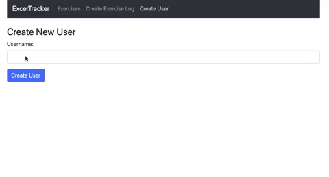

# Exercise Tracker app



Basic CRUD application to learn the MERN stack.
Built following [this tutorial](https://www.youtube.com/watch?v=7CqJlxBYj-M&t).

* Technologies used: *MongoDB, Express, React, Node.js*

## Installation Instructions

1. Fork this repository, clone to your local machine then change into the directory:
```
$ git clone git@github.com:davmcgregor/react-chat-app.git
$ cd react-chat-app
```
2. Load dependencies and run the app for both the client and server directories:
```
$ npm install
$ npm start
```
Note that you have to set your own ATLAS_URI env variable by signing up at [MondoDB Atlas here.](https://www.mongodb.com/cloud/atlas/lp/try2)